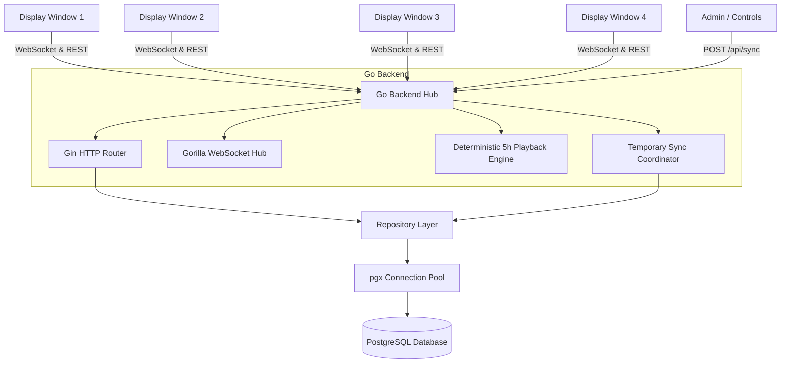

# Multi-Window Media Sequencer with Synchronized Playback

A full-stack, real-time media sequencing and display system built with **Golang (Backend)**, **PostgreSQL (Database)**, **Gorilla WebSocket (Real-time Broadcast Hub)**, and **React + Vite (Frontend)**.

The system powers multiple independent digital display windows that continuously loop their own configured media playlists (images, videos, blank/intermission) over a **5-hour deterministic cycle** (18,000 seconds), accompanied by a **real-time temporary synchronization override engine**.

---

## Architecture Diagram



---

## Features

1. **Independent Multi-Window Displays**:
   - Manages multiple concurrent display windows (Window 1, Window 2, Window 3, Window 4).
   - Each window maintains its own unique, ordered playlist of media assets.
2. **Deterministic 5-Hour Playback Cycle**:
   - Zero per-second database writes. Playback position is derived purely from server clock, 5-hour cycle boundaries (18,000s), and cumulative item durations.
   - Handles continuous looping within cycles and across cycle transitions seamlessly.
3. **Non-Destructive Temporary Synchronization Override**:
   - Triggers temporary synchronization of any selected media asset across all display windows.
   - Synchronized using absolute server timestamps (`startAt`, `endAt`) over WebSocket to guarantee simultaneous screen transition across clients.
   - Never alters or deletes underlying window playlists; automatically returns to normal playback position upon sync expiration.
4. **Late Client & Page Refresh Recovery**:
   - Clients connecting late or refreshing during an active sync query `GET /api/sync/current` to immediately reconstruct active override state.
5. **Dynamic Playlist Reordering & Updates**:
   - Real-time modifications to window playlists broadcast `PLAYLIST_UPDATED` over WebSocket, instantly updating displays without browser reload.
6. **Multi-Format Media Player**:
   - Supports high-resolution images with timed duration, auto-syncing videos, and explicit blank screens.

---

## Technology Stack

- **Backend**: Golang 1.24, Gin Web Framework, Gorilla WebSocket, pgx/v5 PostgreSQL driver, godotenv.
- **Frontend**: React 19, Vite 8, Tailwind CSS v4, Lucide Icons.
- **Database**: PostgreSQL 16 (persistent relational storage with transactions and indexes).
- **Deployment & Orchestration**: Docker, Docker Compose, Nginx.

---

## Folder Structure

```
├── backend/
│   ├── cmd/
│   │   └── server/
│   │       └── main.go                 # Application entrypoint & graceful shutdown
│   ├── internal/
│   │   ├── config/                     # Environment configuration loader
│   │   ├── database/                   # Connection pool, migrations & seed manager
│   │   ├── handlers/                   # REST API controllers & router
│   │   ├── middleware/                 # CORS & logging middleware
│   │   ├── models/                     # Domain structs, DTOs & error formats
│   │   ├── repository/                 # PostgreSQL database queries (pgx)
│   │   ├── services/                   # Business logic (Playback, Sync, Window, Media)
│   │   └── websocket/                  # Gorilla WebSocket hub, client pumps & events
│   ├── migrations/                     # SQL DDL schemas
│   ├── seed/                           # SQL seed data (M1-M14, Windows 1-4)
│   ├── tests/                          # Automated unit & integration tests
│   ├── postman_collection.json         # Postman API test collection
│   ├── Dockerfile                      # Multi-stage Go Dockerfile
│   └── .env.example                    # Backend environment template
├── frontend/
│   ├── src/
│   │   ├── components/                 # MediaPlayer, MediaWindow, WindowGrid, SyncControls, PlaylistEditor
│   │   ├── hooks/                      # useWebSocket, useSync, usePlaylist
│   │   ├── services/                   # REST API client & WebSocket manager
│   │   ├── utils/                      # Client deterministic 5-hour playback engine
│   │   ├── App.jsx                     # Main dashboard layout
│   │   ├── main.jsx                    # React entrypoint
│   │   └── index.css                   # Tailwind styling
│   ├── nginx.conf                      # Production Nginx reverse proxy configuration
│   ├── Dockerfile                      # Multi-stage Node + Nginx Dockerfile
│   └── .env.example                    # Frontend environment template
├── docker-compose.yml                  # Multi-container orchestration (DB + Backend + Frontend)
├── render.yaml                         # Cloud deployment blueprint
└── README.md                           # Documentation
```

---

## Database Schema

```sql
CREATE TABLE windows (
    id SERIAL PRIMARY KEY,
    name VARCHAR(100) NOT NULL UNIQUE,
    created_at TIMESTAMPTZ NOT NULL DEFAULT CURRENT_TIMESTAMP,
    updated_at TIMESTAMPTZ NOT NULL DEFAULT CURRENT_TIMESTAMP
);

CREATE TABLE media (
    id SERIAL PRIMARY KEY,
    name VARCHAR(150) NOT NULL,
    type VARCHAR(20) NOT NULL CHECK (type IN ('image', 'video', 'blank')),
    url TEXT NOT NULL,
    duration INT NOT NULL CHECK (duration > 0),
    created_at TIMESTAMPTZ NOT NULL DEFAULT CURRENT_TIMESTAMP,
    updated_at TIMESTAMPTZ NOT NULL DEFAULT CURRENT_TIMESTAMP
);

CREATE TABLE playlist_items (
    id SERIAL PRIMARY KEY,
    window_id INT NOT NULL REFERENCES windows(id) ON DELETE CASCADE,
    media_id INT NOT NULL REFERENCES media(id) ON DELETE CASCADE,
    position INT NOT NULL CHECK (position >= 0),
    created_at TIMESTAMPTZ NOT NULL DEFAULT CURRENT_TIMESTAMP,
    updated_at TIMESTAMPTZ NOT NULL DEFAULT CURRENT_TIMESTAMP,
    CONSTRAINT uq_window_position UNIQUE (window_id, position)
);

CREATE TABLE sync_events (
    id VARCHAR(64) PRIMARY KEY,
    media_id INT NOT NULL REFERENCES media(id) ON DELETE CASCADE,
    duration INT NOT NULL CHECK (duration > 0),
    start_at TIMESTAMPTZ NOT NULL,
    end_at TIMESTAMPTZ NOT NULL,
    status VARCHAR(20) NOT NULL DEFAULT 'active',
    created_at TIMESTAMPTZ NOT NULL DEFAULT CURRENT_TIMESTAMP
);
```

---

## Playback & Synchronization Model

### 1. Deterministic 5-Hour Cycle Playback
Instead of running expensive database update queries every second across thousands of screens, playback state is computed statelessly using the deterministic formula:

$$\text{CycleDuration} = 18000 \text{ seconds (5 hours)}$$
$$\text{CycleNumber} = \lfloor \text{CurrentUnixTimestamp} / 18000 \rfloor$$
$$\text{CycleElapsed} = \text{CurrentUnixTimestamp} \pmod{18000}$$
$$\text{LoopElapsed} = \text{CycleElapsed} \pmod{\sum \text{duration}(M_i)}$$

The active item $M_k$ is resolved by finding:
$$\sum_{i=0}^{k-1} d_i \le \text{LoopElapsed} < \sum_{i=0}^{k} d_i$$

### 2. Synchronization Temporary Override
1. When a user triggers `POST /api/sync`:
   - Server calculates a synchronized future start time `startAt = now + 2s` (network latency buffer) and `endAt = startAt + duration`.
   - Broadcasts `SYNC_START` event containing target media details and `startAt`/`endAt`.
2. All clients switch display to the synchronized media exactly at `startAt`.
3. Upon reaching `endAt`, clients automatically discard the temporary override and resume their deterministic playlist position.

---

## REST API Specification

### Windows

#### `GET /api/windows`
Fetch all windows and their playlists.
- **Response `200 OK`**:
```json
{
  "data": [
    {
      "id": 1,
      "name": "Window 1 - Main Stage Left",
      "playlist": [
        {
          "id": 1,
          "windowId": 1,
          "mediaId": 1,
          "position": 0,
          "media": { "id": 1, "name": "Cyberpunk City", "type": "image", "duration": 10 }
        }
      ]
    }
  ]
}
```

#### `GET /api/windows/:id`
Fetch single window with calculated playback state.
- **Response `200 OK`**:
```json
{
  "data": {
    "window": { "id": 1, "name": "Window 1" },
    "playbackState": {
      "cycleNumber": 0,
      "cycleElapsedSec": 124,
      "currentItemIndex": 1,
      "itemElapsedSec": 4,
      "itemRemainingSec": 11,
      "isSyncOverride": false
    }
  }
}
```

### Playlists

#### `POST /api/windows/:id/playlist`
Append or insert media into window playlist.
- **Request Body**:
```json
{
  "mediaId": 4,
  "position": 2
}
```

#### `PUT /api/windows/:id/playlist/:itemId`
Reorder position or change media.
- **Request Body**:
```json
{
  "position": 0
}
```

#### `DELETE /api/windows/:id/playlist/:itemId`
Delete item from playlist.

### Media

- `GET /api/media` - List all media assets.
- `POST /api/media` - Create new media asset (`name`, `type`, `url`, `duration`).
- `DELETE /api/media/:id` - Delete media asset.

### Synchronization

#### `POST /api/sync`
Trigger temporary synchronized playback override across all displays.
- **Request Body**:
```json
{
  "mediaId": 2,
  "duration": 20
}
```
- **Response `200 OK`**:
```json
{
  "data": {
    "id": "c7112028-eb82-4fa1-8ca6-d6e326aaae4e",
    "mediaId": 2,
    "duration": 20,
    "startAt": "2026-09-12T12:00:02Z",
    "endAt": "2026-09-12T12:00:22Z",
    "status": "active"
  }
}
```

#### `GET /api/sync/current`
Get currently active sync state (used by refreshed or late-joining clients).
- **Response `200 OK`**:
```json
{
  "data": {
    "active": true,
    "syncEvent": { ... },
    "remainingSec": 14,
    "serverTime": "2026-09-12T12:00:08Z"
  }
}
```

---

## WebSocket Events

| Event Type | Direction | Description |
|---|---|---|
| `SYNC_START` | Server → Client | Broadcasts start of temporary sync override with `startAt` and `endAt` |
| `SYNC_END` | Server → Client | Broadcasts expiration of sync override |
| `PLAYLIST_UPDATED` | Server → Client | Broadcasts playlist change for specific `windowId` |

---

## Local Setup & Quick Start

### 1. Using Docker Compose (Recommended)

Run the complete stack (PostgreSQL + Go Backend + React Frontend + Nginx) with one command:

```bash
docker compose up --build
```

- Frontend: [http://localhost:3000](http://localhost:3000)
- Backend REST & WS: [http://localhost:8080](http://localhost:8080)
- PostgreSQL: `localhost:5432`

---

### 2. Manual Local Setup

#### Prerequisites
- Go 1.22+
- Node.js 20+
- PostgreSQL 14+

#### Backend Setup
1. Create PostgreSQL database:
   ```bash
   createdb mediasequencer
   ```
2. Navigate to backend and copy environment:
   ```bash
   cd backend
   cp .env.example .env
   ```
3. Run backend tests:
   ```bash
   go test -v ./tests/...
   ```
4. Start backend server (auto-runs migrations and sample seeds):
   ```bash
   go run cmd/server/main.go
   ```

#### Frontend Setup
1. Navigate to frontend directory:
   ```bash
   cd frontend
   npm install
   ```
2. Start Vite development server:
   ```bash
   npm run dev
   ```
3. Open [http://localhost:5173](http://localhost:5173).

---

## Postman Collection

Import `backend/postman_collection.json` into Postman to test all REST endpoints with sample payloads.

---

## Assumptions & Trade-offs

1. **Deterministic Playback Calculation**: We deliberately avoided writing state updates to PostgreSQL on every tick (second) to prevent database I/O bottlenecks. State is calculated purely as a function of time and playlist configuration.
2. **Synchronized Start Buffer**: `SYNC_START` uses a configurable 2-second future start buffer (`startAt`) to account for network transmission latency between geographically distributed displays.
3. **Non-Destructive Overrides**: Synchronization acts as a display filter rather than mutating stored playlists, guaranteeing zero data loss or sequence drift after sync ends.
